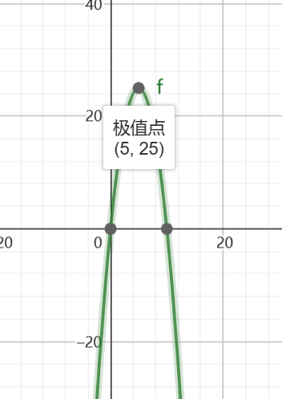

# 比较分数的大小
小学5年纪下册

## 一、基本方法

比较 $\frac{3}{5}$ 和  $\frac{4}{7}$ 的大小？

要比较分数的大小，必须先让2个分数的分母保持一致，求得2个分母的最小公倍数，例如5和7的最小公倍数数是35,

$\frac{3}{5}$ -> $\frac{3*7}{5*7}$ , $\frac{4}{7}$ -> $\frac{4*5}{7*5}$

因为 3 * 7 = 21 , 4 * 5 = 20, 21>20, 所以是，$\frac{3}{5}$ > $\frac{4}{7}$.

换成通用的公式：

$\frac{a}{b}$ ？  $\frac{c}{d}$

$\frac{a*d}{b*d}$ ？  $\frac{c*b}{d*b}$

比较 a*d 和 c*b 的大小即可。

## 二、特殊的规律
如果两个分数的分母-分子的差值相等，有什么特殊的规律吗? 举例：$\frac{3}{5}$ 和 $\frac{5}{7}$ ，5-3=2, 7-5=2，谁大谁小，可以按照上面基本方法计算，但还有另外一个规律：<strong>如果两个分数的分母-分子的差值相等，分母大的那个数值大</strong>。

这个规律(命题)正确吗？该怎么证明？

先假设，两个分数的分子分母的差值都等于2，

$\frac{a}{a+2}$ ，$\frac{a+2}{a+2+2}$,

根据基本方法，我们比较 a*(a+2+2) 和 (a+2)*(a+2)的大小，这个式子看起来像长方形两条边相乘求面积，特殊的是，这两个长方形的周长是相等的：a+(a+2) = (a+2)+(a+2) = 2a+4. 

周长相等的情况下，那个长方形的面积最大呢？把两个的面积展开：越接近正方形的那个，面积越大。

$a*(a+2+2) = a^2 + 4a $

$(a+2)*(a+2) = a^2 + 4a + 4 $ 

上面那个，假设分子分母都相差为2也仍然特殊了，再找个字母代替差值：差值为m

$\frac{a}{a+m}$ ，$\frac{a+n}{a+n+m}$,

$a*(a+n+m) = a^2 + (m+n)*a $

$(a+n)*(a+m) = a^2 + (m+n)*a + m*m $ 

## 三、为什么 周长相等的长方形，边长越接近面积越大？

长+宽 = l，设, 长 = x，宽 = l-x, 面积 y = x * (l-x) , 2次方程，一个极值点。

https://www.geogebra.org/graphing?lang=zh_CN

